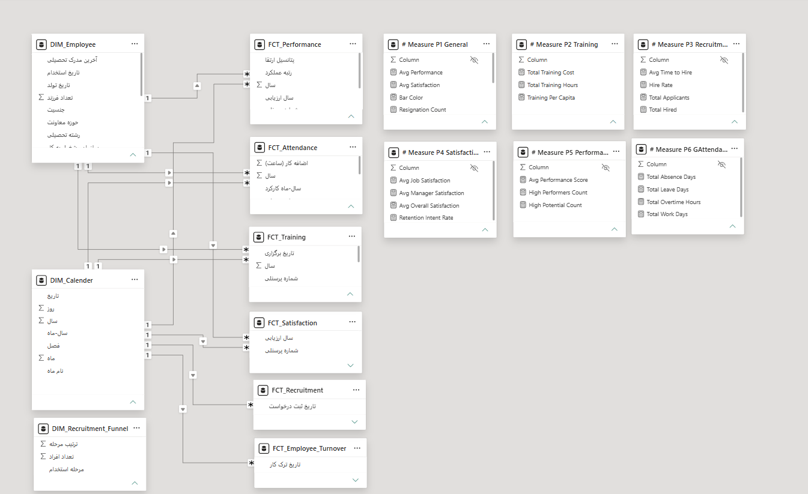

# 📊 پورتفولیو و نمونه‌کارهای تحلیل داده و داشبوردسازی منابع انسانی

به پورتفولیو و نمونه‌کارهای تخصصی تحلیل داده و داشبوردسازی منابع انسانی خوش آمدید.

---

## 👤 درباره من

کارشناس ارشد مدیریت منابع انسانی و متخصص **HR Analytics** با سابقه طراحی و پیاده‌سازی داشبوردهای مدیریتی بر اساس شاخص‌های استاندارد **ایزو ۳۰۴۱۴ (ISO 30414)**.

* 📱 **شماره تماس:** 09380707051
* 📧 **ایمیل:** siyadatii.mohammad@gmail.com
* 🔗 **لینکدین:** [Mohammad Siyadati](https://www.linkedin.com/in/mohammad-siyadati)

---

## 🎥 ویدئوی معرفی و دموی داشبورد Power BI

جهت مشاهده دموی تعاملی و نحوه کارکرد داشبورد جامع منابع انسانی، ویدئوی زیر را مشاهده نمایید:

▶️ **[برای مشاهده ویدئوی نمونه کار کلیک کنید](https://aparat.com/v/qft6mi2)**

  

---

## 🚀 ویژگی‌ها و صفحات داشبورد جامع منابع انسانی (Power BI)

این داشبورد چندصفحه‌ای با هدف **تحلیل ۳۶۰ درجه‌ای داده‌های منابع انسانی** و تسهیل تصمیم‌گیری‌های مبتنی بر داده (Data-Driven Decision Making) طراحی شده است. تمامی بخش‌ها بر اساس شاخص‌های کلیدی عملکرد (KPIs) استاندارد ایزو ۳۰۴۱۴ و با رعایت اصول تجربه کاربری (UX/UI) پیاده‌سازی شده‌اند.

### 📌 بخش‌ها و صفحات اصلی داشبورد:
* **خلاصه مدیریتی (Executive Summary):** پایش کلی شاخص‌های کلیدی مانند نرخ خروج، پرسنل فعال، میانگین سابقه و تحلیل روند‌های دوره‌ای.
* **تحلیل ترک خدمت (Employee Turnover Analytics):** آنالیز عمیق علل خروج پرسنل، تفکیک خروج داوطلبانه/غیرداوطلبانه و بررسی نرخ ماندگاری به تفکیک واحدها.
* **جذب و استخدام (Recruitment & Funnel Analysis):** تحلیل قیف استخدام، زمان پر کردن پوزیشن‌ها (Time-to-Fill) و ارزیابی کانال‌های ورودی پرسنل.
* **ارزیابی عملکرد و آموزش (Performance & Training):** پایش توزیع نمرات ارزیابی عملکرد، ماتریس ۹ خانه (9-Box Grid) و اثربخشی دوره‌های آموزشی.
* **حضور، غیاب و کارکرد (Attendance Analytics):** تحلیل نرخ غیبت، اضافه‌کاری، مرخصی‌ها و الگوی تردد پرسنل.

🛠 **کدنویسی و فنون به‌کاررفته:**
* فرمول‌نویسی و پیاده‌سازی محاسبات تحلیلی و زمانی با **DAX**
* پاک‌سازی، آماده‌سازی و تغییر شکل داده‌ها با **Power Query**
* پیاده‌سازی **RLS (Row-Level Security)** جهت کنترل سطوح دسترسی به داده‌های حساس منابع انسانی

---

## 📐 معماری و مدل‌سازی داده‌ها (Data Modeling)

در تمامی پروژه‌ها، معماری داده بر اساس استاندارد **مدل ستاره‌ای (Star Schema)** پیاده‌سازی شده است. این ساختار علاوه بر بهینه‌سازی سرعت کوئری‌ها و کارایی محاسبات DAX، قابلیت توسعه‌پذیری و ارتباط شفاف بین جداول بعد (Dimension) و حقیقت (Fact) را فراهم می‌سازد.

  

---

## 📸 تصاویر و نمای کلی داشبورد چندصفحه‌ای Power BI

<!-- ردیف اول: ۳ تصویر نخست -->

  
  
  

<!-- ردیف دوم: ۳ تصویر دوم -->

  
  
  

---

## 📊 سایر داشبوردهای تک‌صفحه‌ای طراحی‌شده با Excel

در کنار پروژه‌های Power BI، مجموعه‌ای از داشبوردهای عملیاتی و مدیریتی در محیط **Microsoft Excel** (با استفاده از Power Query، فرمول‌نویسی‌های پیشرفته و Pivot Tables) جهت تحلیل سریع موضوعات خاص پیاده‌سازی شده است:

### 🔹 معرفی داشبوردها:
* **داشبورد حقوق و دستمزد (Compensation & Benefits):** تحلیل توزیع هزینه‌های پرسنلی، آنالیز ارشدیت و بررسی گپ‌های پرداختی.
* **داشبورد آنالیز ساختار سازمانی (Organizational Structure):** پایش وضعیت رده‌های سازمانی، گستره کنترل (Span of Control) و ترکیب نیروی انسانی.
* **داشبوردهای عملیاتی و پرسنلی:** تحلیل سریع شاخص‌های کلیدی منابع انسانی جهت گزارش‌دهی‌های دوره‌ای به مدیریت ارشد.

<!-- نمایش تصاویر داشبوردهای اکسل -->

  
  
  
  

